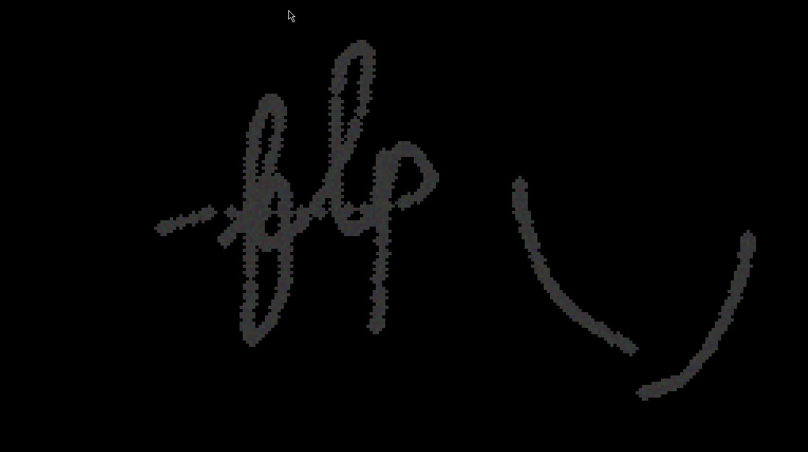

# falling-sand

A real-time particle simulation engine featuring falling sand physics, built with C and SDL3.



## Building

### Build Steps

```bash
mkdir build && cd build
cmake ..
cmake --build .
```

### Run the Application

```bash
./falling_sand
```

## Controls

| Input | Action |
|-------|--------|
| **1, 2, 3** | Choose particle (sand, rock, empty) |
| **R** | Reset grid |
| **Left Mouse** | Hold to place particles |
| **ESC** | Exit application |

